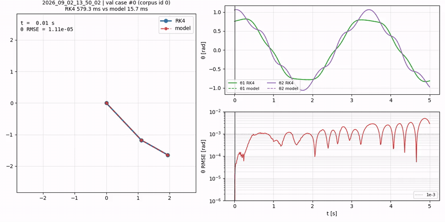

# Double-Pendulum Flow-Map PINN

English | [한국어](README.ko.md)

A neural **flow map** that advances the double-pendulum state one window (`march_dt` = 0.25 s) at a time.
Instead of fitting a whole trajectory at once, the end state of each window is fed in as the initial condition of the next.
Training combines a data term, physics residuals (kinematics, equations of motion, energy), and a rollout (pushforward) term.



Source mp4: [`scratch/rk4_vs_model.mp4`](scratch/rk4_vs_model.mp4). Left: RK4 reference (grey) overlaid with the model (colour). Right: θ trajectories and θ RMSE.
RK4 uses the same dt = 5e-6 as data generation; the model emits 25 τ points per window.

## Numbers

Validation case 0, free marching over 0–5 s (20 windows).

| Item | Value |
|---|---|
| Speedup (RK4 dt 5e-6 / model) | 40× |
| θ RMSE mean / max / at 5 s | 1.3e-3 / 4.9e-3 / 2.9e-3 rad |
| First time θ RMSE exceeds 1e-3 | 0.60 s |
| Parameters | 1.61 M |
| RolloutBestVal (marching MSE over 100 cases) | 1.4e-5 |

## Problem setup

Input `(τ, IC, m1, m2, L1, L2)`, output `[Δθ1, Δθ2, ω1, ω2]`, `τ ∈ [0, march_dt]`.

- θ enters only as sin/cos and the output is **Δθ = θ(τ) − θ_IC**. Emitting absolute angles would make two windows that differ only by a winding number (2π) share the same input but different labels. Δθ is 0 at τ=0, so the contradiction disappears.
- Marching: `θ_next = θ_start + Δθ(march_dt)`, `ω_next = ω(march_dt)`. 5 s = 20 windows.
- The error of one window becomes the IC error of the next, and chaos (λ ≈ 0.66/s) amplifies it. See Limitations.

## Model

```
τ ──Fourier(32, 0.2–20 Hz)──▶ trunk: 12 × FiLMBlock(256) ──▶ head_θ(2), head_ω(2)
                                      ▲ (γ_i, β_i)
IC(6) + ParamEmbed(m,L → 32) ──FiLMCond──┘
```

- The trunk sees only τ. Case information is injected per block through FiLM `(γ, β)`: `h ← h + γ·SiLU(W h + b) + β`.
  The skip path is unmodulated, so the block Jacobian stays bounded as `I + O(γ)`.
- `(γ, β)` do not depend on τ, so they are computed once per case (`CondOf`) and reused in rollout and jvp.
- Hard IC (`c1`): the output is structurally forced to Δθ=0, ω=ω_IC at τ=0.

## Losses

| Term | Content |
|---|---|
| `data` | Teacher-forced MSE on Δθ, ω |
| `kin` | `dΔθ/dt = ω` (jvp) |
| `phys` | Relative residual of `dω/dt = f(θ_IC+Δθ, ω)` |
| `energy` | Relative residual of `E(τ) = E(IC)` |
| `roll` | Pushforward: roll several windows under no_grad to reach an off-manifold IC, then fit one window to the true trajectory (Huber) |

Per-term gradient balancing (`grad_scale`), curriculum ramps, and per-term gradient clipping multiply together.
Collocation points are redrawn iid-uniform every step.

## Limitations

- 1e-3 rad over the full 0–5 s span is **not reached**. The cause is chaos amplification, not capacity.
  A single window's error grows ~80× over 20 windows, so 1e-3 at 5 s would need per-window error at least 11× below the current level. Shrinking `march_dt` adds handoffs and cancels the gain.
- The 1e-3 horizon is 0.6–0.8 s depending on the case. Within that range there are no spikes at window seams.
- Flip (full-rotation) trajectories are outside the pretraining set. `Train/finetune.py` fine-tunes on mixed flip data, but flip error remains two orders of magnitude above nonflip.

## Reproduce

Dependencies: Python 3.12, PyTorch 2.12 (CUDA), NumPy, Numba, tqdm.

```bash
# 1. Draw ICs → generate RK4 labels (nonflip, dt 5e-6)
python state/states.py nonflip --n_total 70000 --out data/nonflip_70k_states.npy --seed 0
python state/dfss.py   nonflip --states data/nonflip_70k_states.npy --out data/nonflip_RK4_0_5s_70k.npy
# Merge several corpora
python state/concat_corpora.py a.npy b.npy --out data/nonflip_RK4_0_5s_70k.npy

# 2. Pretrain (see config.toml; results go to model/<timestamp>_<name>/)
python Train/train.py --config config.toml
python Train/train.py --resume model/<run> --ckpt latest        # continue

# 3. Flip finetune
python Train/finetune.py --pretrain model/<run> --ckpt val --config <finetune.toml>
```

Checkpoints: `best.pt` (teacher-forced val), `best_ode.pt` (physics residual), `best_extrap.pt` (extrapolation), `latest.pt`.
`log.csv` is newest-first.

## Layout

| Path | Role |
|---|---|
| `PINNsTrainer/` | Network (`networks.py`), losses (`Loss.py`), train step and trainer, LR scheduler, config parser |
| `state/` | Double-pendulum EOM and RK4 (`Double_pendulum.py`), IC sampling (`states.py`), label generation (`dfss.py`) |
| `Train/` | Training loops (`train.py`, `finetune.py`, `loop_common.py`) |
| `config.toml` | Current reference run config |
